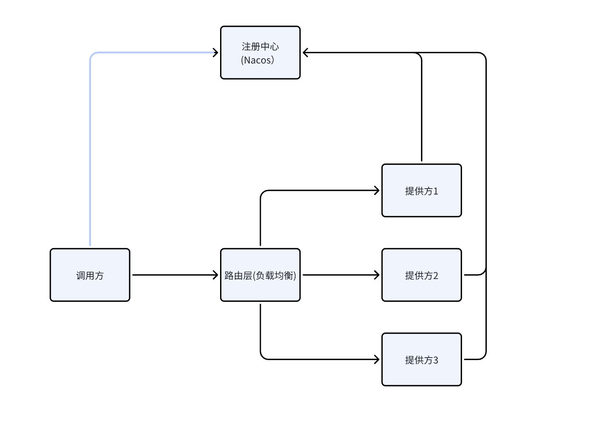

# lin-rpc-framework
为了春招 找个好工作 把rpc项目重新启动了
### how to run?
直接启动Provider模块下的TestServer以及Consumer包下的Consumer即可

### current architecture

### 可能遇到的面试题
1.什么是rpc框架? 

RPC（Remote Procedure Call，远程过程调用) 调用方无需关系网络传输等细节只需要提供方法名等参数就可以直接调用提供方的服务

2.rpc和http的区别是什么?

本质和应用场景：RPC是一种方法，允许程序通过网络调用另一台计算机上的子程序，而无需了解底层网络技术。它主要被用于大型网站，其中系统繁多、业务线复杂，且对效率有较高要求。HTTP则是一种无状态的网络协议，主要用于分布式、协作式和超媒体信息系统，是万维网数据通信的基础。

协议层次：RPC跨越了传输层和应用层，而HTTP位于应用层。RPC基于TCP/IP协议，也可以基于HTTP协议实现。

开发难度：一般来说，HTTP的开发相对简单，而RPC的开发则相对较难。

效率：RPC的效率通常比HTTP高，特别是在参数传递和数据传输方面。RPC框架针对远程调用的协议效率更高，可以基于Thrift实现高效的二进制传输。

通知机制：HTTP协议需要事先通知修改Nginx/HAProxy配置，而RPC能做到自动通知，不影响上下游。

灵活性：HTTP对服务的提供和调用方没有任何技术限定，更自由灵活，更符合微服务理念。然而，RPC要求服务调用方和服务提供方使用统一的RPC框架。

3.为什么采用kryo kryo的优势是什么?

先说Json序列化的缺点:
基于 JSON 的序列化器有一个毛病，就是在某个类的属性反序列化时，
如果属性声明为 Object 的，就会造成反序列化出错，通常会把 Object 属性直接反序列化成 String 类型，就需要其他参数辅助序列化。
并且，JSON 序列化器是基于字符串（JSON 串）的，占用空间较大且速度较慢。

Kryo:
Kryo 是一个快速高效的 Java 对象序列化框架，主要特点是高性能、高效和易用。最重要的两个特点，
一是基于字节的序列化，对空间利用率较高，在网络传输时可以减小体积；
二是序列化时记录属性对象的类型信息，这样在反序列化时就不会出现之前的问题了。

### Tip
各位如果有任何问题都可以提交pr给我 我会及时处理的
qq:2275966457